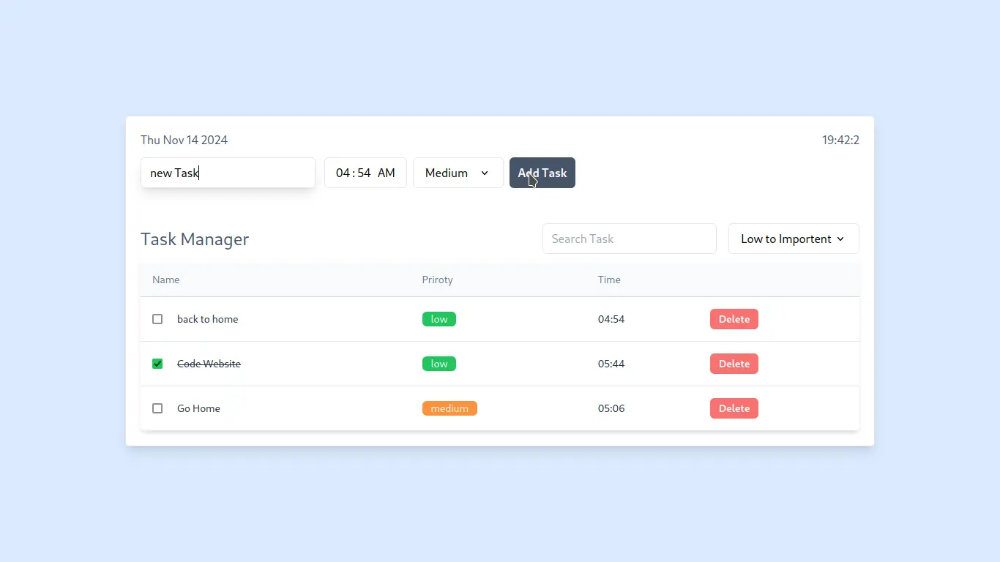
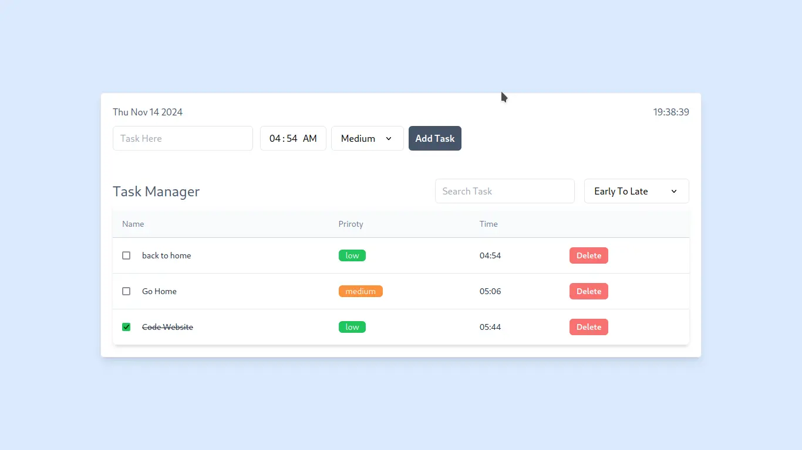
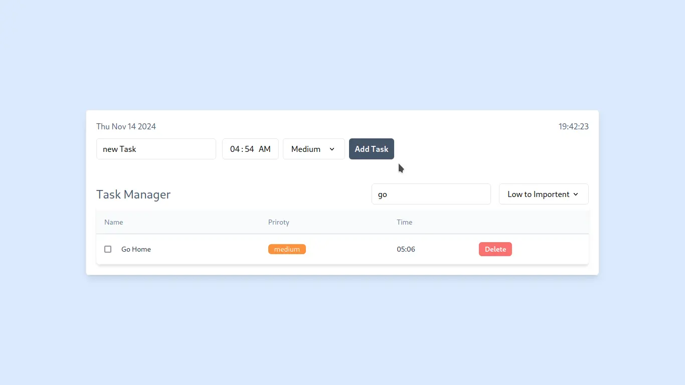

# Task Manager Application
# Website Link : assignment-task-manager.vercel.app 
## Overview
This Task Manager application is built using React and TypeScript (or JavaScript). It allows users to add, delete, and manage tasks with basic persistence in local storage. Additional features include task search, task completion marking, priority setting, and sorting options to enhance task organization.

## Features
- **Add Task**: Users can input a title to add a new task to the list.
- **Delete Task**: Remove tasks from the list.
- **Task Persistence**: Tasks are stored in `localStorage` so they remain available after a page refresh.
- **Search Tasks**: A search bar helps users find tasks by title.
- **Mark as Completed**: Users can mark tasks as completed to visually separate them.
- **Priority Setting**: Assign priority levels (e.g., Low, Medium, High) to tasks.
- **Task Sorting**: Sort tasks by criteria like creation date, priority, or completion status.

## Screenshots 
### Main Interface


### Adding a Task


### Sorting Options


### Searching Options


## Setup and Installation
To set up and run the project locally, follow these steps:

1. **Clone the repository**:
   ```bash
   git clone https://github.com/mdsharifulislam-r/Assignment-Task-Manager.git
   cd task-manager
   ```
2. **Install dependencies**:
   ```bash
   npm install
   ```
3. **Build the application for production**(optional):
   ```bash
   npm run build
   ```

